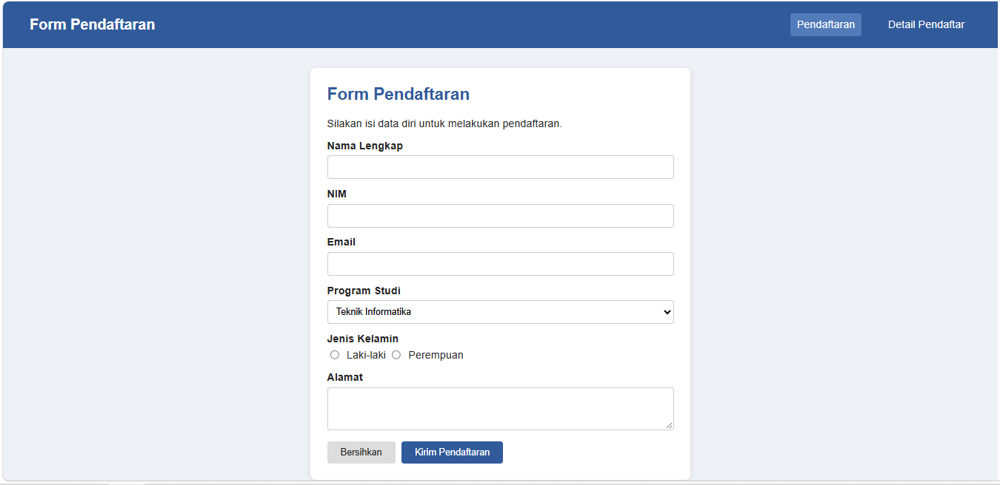
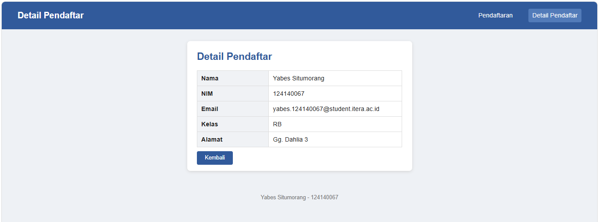

# Tugas 3 - Pengembangan Aplikasi Web

## Data Diri

**Nama:** Yabes Situmorang

**NIM:** 124140067

**Kelas:** RB

**Link GitHub:** https://github.com/yabes124140067-commits/PAWtask3

## Deskripsi

Tugas ini membuat dua halaman web sederhana:

1. `index.html` sebagai halaman pendaftaran menggunakan form dengan `method="GET"`.
2. `detail.html` sebagai halaman detail informasi pendaftar yang dibuat secara dummy.

Data dari form dirancang untuk dikirim melalui query string menggunakan beberapa parameter sesuai dengan input form. Tugas hanya mendesain query string dan tidak menangkap atau mengolah data tersebut dengan JavaScript.

## Desain Query String

Form pada `index.html` menggunakan method GET untuk mengirim data melalui URL menuju `detail.html`.

Contoh query string:

```text
detail.html?nama=Yabes+Situmorang&nim=124140067&email=contoh%40email.com&prodi=Teknik+Informatika&jk=Laki-laki&alamat=Jl.+Way+Hui
```

Query string hanya dirancang untuk dikirim melalui URL dan tidak diolah menggunakan JavaScript pada halaman `detail.html`.

## Fitur yang Diterapkan

- Form pendaftaran dengan method GET.
- Pengiriman data melalui query string.
- Halaman detail pendaftar.
- Halaman detail dibuat sebagai halaman dummy.
- Layout menggunakan CSS.
- Tabel dan form menggunakan CSS.
- Menggunakan beberapa jenis selector CSS seperti selector elemen, class, atribut, dan pseudo-class.

## Tampilan

### 1. Halaman Pendaftaran



Halaman ini digunakan untuk mengisi data pendaftar. Form terdiri dari nama lengkap, NIM, email, program studi, jenis kelamin, dan alamat.

### 2. Halaman Detail Pendaftar



Halaman ini menampilkan informasi pendaftar dalam bentuk tabel. Halaman detail dibuat sebagai halaman dummy dan tidak mengolah data dari query string menggunakan JavaScript.

## Cara Menjalankan

1. Buka folder proyek di VS Code.
2. Jalankan `index.html` menggunakan Live Server atau buka langsung di browser.
3. Isi form pendaftaran.
4. Klik tombol **Kirim Pendaftaran**.
5. Browser akan menuju `detail.html` dan query string akan terlihat pada address bar.

## Struktur Folder

```text
yabes_124140067_tugas3/
├── index.html
├── detail.html
├── style.css
├── README.md
├── halaman-pendaftaran.png
└── halaman-detail.png
```